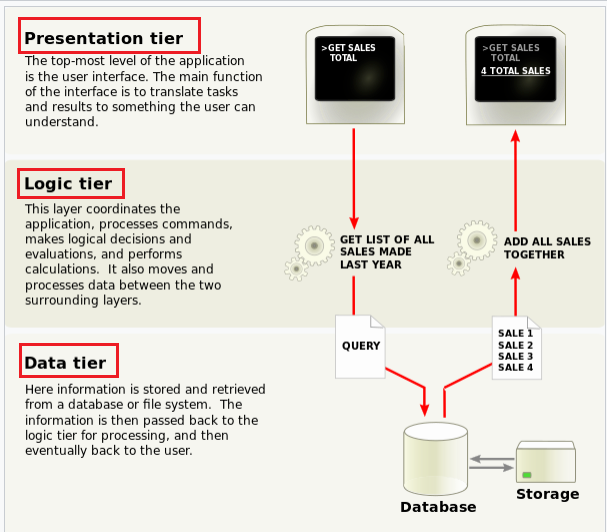

# WEB-SOLUTION-IMPLEMENTATION-WITH-WORDPRESS

A Three-Tier Architecture consisting of a **`Presentation or Client tier`** (Frontend), **`Logic or Application tier`** (Backend) and **`Data tier`**(Database).

A three-tier application is a type of software architecture that divides an application into three interconnected layers, each responsible for specific functionality and tasks. These layers typically include:

- **Presentation or Client Tier (Frontend):**

Also known as the "user interface" or "client tier."
This layer interacts directly with users and presents the application's user interface.
It handles user input, displays information, and interacts with the user through graphical user interfaces (GUIs), web browsers, mobile apps, or other interfaces.
The presentation tier sends user requests and data input to the application's logic tier for processing.

### Presentation or Client tier framework include:
- **Web Applications:**

`HTML, CSS, JavaScript (Client-Side):` These are fundamental technologies used for creating the structure, styling, and interactivity of web pages.

`Frontend Frameworks:` Frameworks like React.js, Angular, or Vue.js are often used to build dynamic and interactive user interfaces for web applications.
`CSS Frameworks:` Frameworks like Bootstrap or Materialize CSS provide pre-designed CSS components and stylesheets to facilitate responsive and visually appealing web design.

- **Mobile Applications:**

`Native Mobile Frameworks:` For native mobile app development, frameworks like React Native, Flutter, or Xamarin allow developers to build cross-platform mobile apps using a single codebase.

`iOS:` Swift and UIKit are commonly used for native iOS app development.

`Android:` Kotlin and Android SDK are commonly used for native Android app development.

- **Application or Logic Tier (Backend):**

Also known as the "business logic" or "processing tier."
This layer contains the application's business logic and core functionality.
It processes and manipulates data, performs calculations, enforces business rules, and communicates with external systems or databases.
The application logic tier receives requests from the presentation tier, processes them, and sends back responses or results.

- **Application Logic Tier (Backend) Framework includes:**

`Node.js` (JavaScript): A popular runtime environment for building server-side applications using JavaScript. 

`Frameworks like Express.js` are commonly used with Node.js for building APIs and server-side logic.

`Java:` Frameworks like Spring Boot, Jakarta EE (formerly Java EE), or Play Framework are commonly used for building enterprise-grade backend applications.

`Python:` Frameworks like Django or Flask are commonly used for building web applications and APIs with Python.

`Ruby:` Ruby on Rails is a popular framework for building web applications with Ruby.

`C#:` ASP.NET Core is commonly used for building web applications and APIs with C#.

`PHP:` Frameworks like Laravel or Symfony are commonly used for building web applications with PHP.
- **Middleware and Integration Frameworks:**

`Message Brokers:` Technologies like RabbitMQ, Apache Kafka, or ActiveMQ are used for asynchronous messaging and communication between different components of the application.
Enterprise Service Buses (ESBs): Middleware platforms like Apache Camel or MuleSoft provide tools and frameworks for integrating different applications, systems, and services within the enterprise.

`RESTful API Frameworks:` Libraries like Swagger, OpenAPI, or RAML are used for designing, documenting, and implementing RESTful APIs.

- **Data Tier (Backend):**

Also known as the "data layer" or "storage tier."
This layer manages and stores data used by the application.
It includes databases, file systems, or other data storage mechanisms.
The data tier handles data retrieval, storage, updating, and deletion operations.
The application logic tier interacts with the data tier to retrieve or modify data as required by user requests or application logic.

Each tier in a three-tier architecture is independent and can be developed, deployed, and scaled separately. This modular structure enhances flexibility, scalability, and maintainability of the application. It also promotes better separation of concerns, allowing developers to focus on specific layers without worrying about the intricacies of other layers.

- **Data Tier (Backend) frameworks includes:**

`Database Management Systems (DBMS):`

`Relational Databases:` MySQL, PostgreSQL, Oracle Database, Microsoft SQL Server, SQLite, etc., are commonly used for structured data storage and management.

`Non-Relational Databases (NoSQL):` MongoDB, Cassandra, Couchbase, Redis, etc., are commonly used for storing and managing unstructured or semi-structured data.

`ORM Frameworks (Object-Relational Mapping):`
Libraries like Hibernate (for Java), Sequelize (for Node.js), SQLAlchemy (for Python), Entity Framework (for .NET), etc., are used to map database tables to object-oriented models and simplify database interactions in application code.

`Query Builders and Data Access Libraries:`
Libraries like JDBC (for Java), psycopg2 (for Python), Sequelize (for Node.js), ADO.NET (for .NET), etc., provide APIs and tools for executing database queries, transactions, and data manipulation operations.

### **Use Case of a Three-tier application**

Three-tier architectures are commonly used in **`web applications`**, **`enterprise systems`**, and **`distributed computing environments`**. They provide a structured and scalable approach to building complex software systems while promoting reusability, maintainability, and performance.

**PS:** The reason why a three tier architecture is important is that it allows you to eperate your application into logical compartments. In a three-tier appliaction, you cannot have the client tier bypasing the logic tier to communicate with the data tier. this is one of the rules imposed on this kind of architecture or pattern. A **`two-tier`** archiecture typically has the logic and data tier combined together.

A `MEAN, MERN, LAMP, LEMP` or any four letter stack is typically using a three-tier architecture.
