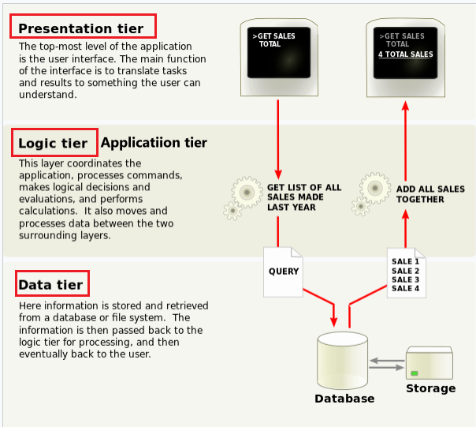

# WEB-SOLUTION-IMPLEMENTATION-WITH-WORDPRESS

A Three-Tier Architecture consisting of a **`Presentation or Client tier`** (Frontend), **`Logic or Application tier`** (Backend) and **`Data tier`**(Database).

A user accesses your application using a Front-end or presentation layer. This Presentation Layer interacts with the Application Layer or Back-end. The Application Layer on the Back-end saves and retrives information from tha Database as when needed. 

These Three distinct Layers or tiers viz: the Presentation Layer (Front_end), the Application Layer (Back-end) and Database Layer (Database) is the reason this architecture is called a three tier. 

The reason why a three tier architecture is important is that it allows you to eperate your application into logical compartments. In a three-tier appliaction, you cannot have the client tier bypasing the logic tier to communicate with the data tier. this is one of the rules imposed on this kind of architecture or pattern. A **`two-tier`** archiecture typically has the logic and data tier combined together.

PS: A MEAN, MERN, LAMP, LEMP or any four letter stack is typically using a three-tier architecture.
