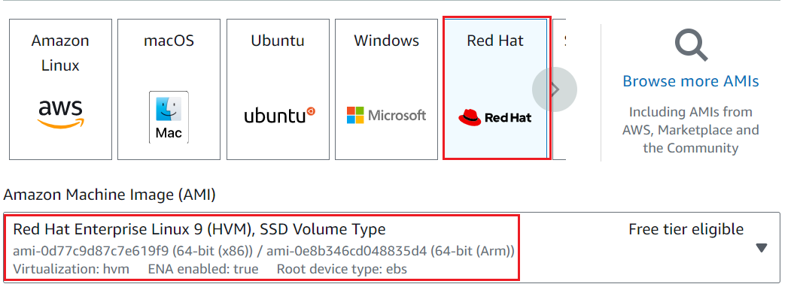

- **Provission an EC2 Instance that will serve as “Web Server”.**

Launch an EC2 instance that will serve as "Web Server". Create 3 volumes in the same AZ as your Web Server EC2, each of 10 GiB.

I will be using a **`RedHat OS`** as the underlying OS for my EC2 Server in this project.

