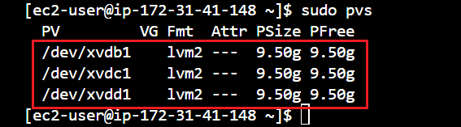
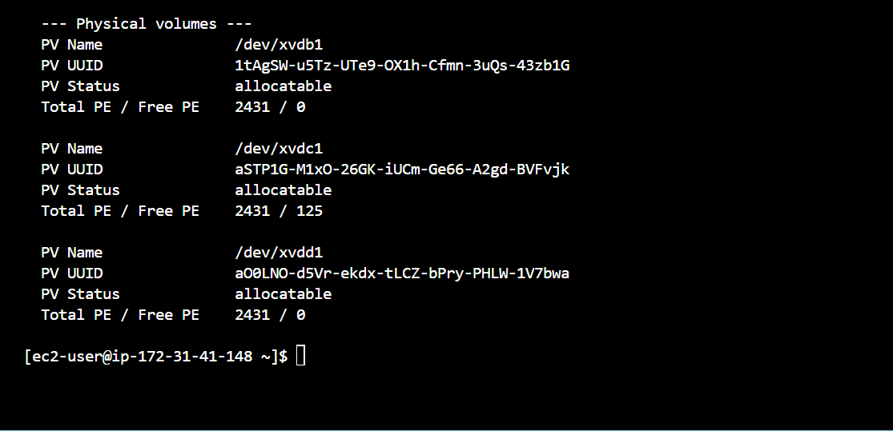
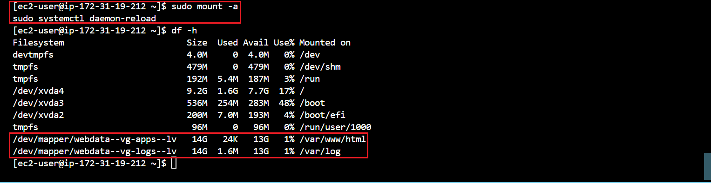

- **Provission an EC2 Instance that will serve as “Web Server”.**

Launch an EC2 instance that will serve as "Web Server". 

I will be using a **`RedHat OS`** as the underlying OS for my EC2 Server in this project.


### **Create 3 EBS (Elastic Block Store) Volumes in the same AZ (Availability Zone) as your Web Server EC2, each EBS Volume should be 10 GB in size.**


3 EBS volumes (volume a, b, & c) has been succesfully created and available for attachment to our server.


### **Open up the Linux terminal to begin configuration**

Run 
```
sudo yum update
```
&
```
sudo yum upgrade
```
to update and upgrade the `RedHat OS`

** Unlike **`apt`** (Advanced Package Tool),which is is a command-line package management utility used primarily in ***Debian-based Linux distributions, such as Ubuntu, Debian, and Linux Mint***,  **`yum`** is a command-line package management utility used in ***Red Hat-based Linux distributions, such as CentOS, Fedora, and Red Hat Enterprise Linux (RHEL)***. It stands for "`Yellowdog Updater Modified`." yum simplifies the process of installing, updating, removing, and managing software packages on a Linux system.

Use 
```
lsblk 
```
command to inspect what block devices are attached to the server. 

The **`lsblk`** command is a Linux command used to list information about block devices attached to the system. ***It stands for "list block devices."***

Notice names of your newly created devices. All devices in Linux reside in **`/dev/`** directory. 


### **Inspect it with ls /dev/ and make sure you see all 3 newly created block devices there – their names are xvdb, xvdc, xvdd.**


Use 
```
df -h 
```
command to see all mounts and free space on your server.

### **Use fdisk utility to create a single partition on each of the 3 disks.**

```
sudo fdisk /dev/xvdb
```


### **Use `lsblk` utility to view the newly configured partition on each of the 3 disks.**


Install `lvm2` package using 

**`lvm2:`** This is a ***Logical Volume Manager*** version 2, which is a system toolset that provides logical volume management capabilities on Linux systems. LVM allows you to manage disk space more flexibly by abstracting physical storage devices into logical volumes that can be resized and moved dynamically.

```
sudo yum install lvm2
```
Run 
```
run rpm -q lvm2 

or

yum list installed | grep lvm2
```
to ensure lvm is succesfully installed.


run
```
sudo lvmdiskscan
```
 command to check for available partitions.


### **Use **`pvcreate utility`** to mark each of 3 disks as physical volumes (PVs) to be used by LVM.**


Verify that your Physical volume has been created successfully by running 
```
sudo pvs
```


### **Use `vgcreate utility` to add all 3 PVs to a volume group (VG). Name the VG webdata-vg**

The **`vgcreate utility`** is part of the Logical Volume Manager (LVM) suite of tools on Linux systems. It is used to create a new volume group (VG) within the LVM infrastructure.

```
sudo vgcreate webdata-vg /dev/xvdb1 /dev/xvdc1 /dev/xvdd1
```
Verify that your VG has been created successfully by running 
```
sudo vgs
```


### **Use `lvcreate utility` to create 2 logical volumes. apps-lv (Use half of the PV size), and logs-lv Use the remaining space of the PV size.** 

***NOTE: apps-lv will be used to store data for the Website while, logs-lv will be used to store data for logs.***

```
sudo lvcreate -n apps-lv -L 14G webdata-vg
sudo lvcreate -n logs-lv -L 14G webdata-vg
```
Verify that your Logical Volume has been created successfully by running 
```
sudo lvs
```


### **Verify the entire setup**

sudo vgdisplay -v #view complete setup - VG, PV, and LV



```
sudo lsblk 
```


### **Use `mkfs.ext4` to format the logical volumes with ext4 filesystem**
```
sudo mkfs -t ext4 /dev/webdata-vg/apps-lv
sudo mkfs -t ext4 /dev/webdata-vg/logs-lv
```

The **`mkfs.ext4`** command is used in Linux systems to create an ext4 file system on a block device. ***Ext4 (Fourth Extended File System)*** is a widely used file system type in Linux distributions due to its stability, performance, and features.

For example after running the command `sudo mkfs.ext4 /dev/sdb1
` the mkfs.ext4 command formats the specified block device /dev/sdb1 with the ext4 file system. This process initializes the file system metadata structures, sets up the journaling system for data consistency, and prepares the block device for storing files and directories.

Once the file system is created, you can mount it to a directory in the Linux file system hierarchy using the mount command, allowing you to access and use the storage space provided by the block device.

```
sudo mkfs -t ext4 /dev/webdata-vg/apps-lv
sudo mkfs -t ext4 /dev/webdata-vg/logs-lv
```


### **Create /var/www/html directory to store website files**

```
sudo mkdir -p /var/www/html
```
### **Create /home/recovery/logs to store backup of log data**

```
sudo mkdir -p /home/recovery/logs
```
### **Mount /var/www/html on apps-lv logical volume**
```
sudo mount /dev/webdata-vg/apps-lv /var/www/html/
```
### **Use `rsync utility` to back up all the files in the log directory /var/log into /home/recovery/logs (This is required before mounting the file system)**

```
sudo rsync -av /var/log/. /home/recovery/logs/
```


### **Mount /var/log on logs-lv logical volume. (Note that all the existing data on /var/log will be deleted. That is why the step above is very important)**
```
sudo mount /dev/webdata-vg/logs-lv /var/log
```
### **Restore log files back into /var/log directory**
```
sudo rsync -av /home/recovery/logs/. /var/log
```

### **UPDATE THE `/ETC/FSTAB` FILE**

### **Update /etc/fstab file so that the mount configuration will persist after restart of the server.**

The UUID (Universally Unique Identifier) of the device will be used to update the /etc/fstab file

```
sudo blkid
```


### Install nano text editor first 
```
sudo yum install nano
```
Update /etc/fstab in this format using your own UUID and rememeber to remove the leading and ending quotes.


sudo nano /etc/fstab


- **Test the configuration and reload the daemon**

```
sudo mount -a
sudo systemctl daemon-reload
```
Verify your setup by running 
```
df -h
```

The **`df -h`** command is used to display disk space usage in a human-readable format on Unix-like operating systems, including Linux. Here's what each part of the command does:

**`df`** : This command stands for "disk free" and is used to display information about available disk space on file systems.

**`-h`** : This option stands for "human-readable" and is used to display disk space sizes in a format that is easier for humans to read. When used with df, it formats the sizes in kilobytes (K), megabytes (M), gigabytes (G), and terabytes (T), depending on the size of the disk.

So, when you run **`df -h`**, the command will list all mounted file systems along with information about their total size, used space, available space, and utilization percentage, in a human-readable format.

output must look like this 🔽




- ### STEP 2: Prepare the Database Server

Launch a second RedHat EC2 instance that will have a role – ‘DB Server’ Repeat the same steps as for the Web Server, but instead of `apps-lv` and `logs-lv`, create `db-lv` and `logs-lv`, then mount it to `/db directory` instead of `/var/www/html/`.

```
sudo lvcreate -n db-lv -L 14G webdata-vg
sudo lvcreate -n logs-lv -L 14G webdata-vg
```

```
sudo mkfs -t ext4 /dev/webdata-vg/db-lv && sudo mkfs -t ext4 /dev/webdata-vg/logs-lv
```

 Create /db directory to store database files instead of  create /var/www/html to store website files.
 ```
sudo mkdir -p /db
```

Create /home/recovery/logs to store backup of log data
```
sudo mkdir -p /home/recovery/logs
```

Mount /db on db-lv logical volume
```
sudo mount /dev/webdata-vg/db-lv /db
```

Use rsync utility to back up all the files in the log directory /var/log into /home/recovery/logs (This is required before mounting the file system)

```
sudo rsync -av /var/log/. /home/recovery/logs/
```

Use rsync utility to back up all the files in the log directory /var/log into /home/recovery/logs (This is required before mounting the file system)

not yet executed the step below 👎

```
sudo rsync -av /var/log/. /home/recovery/logs/
```

### Step 3 Install WordPress on your Web Server

Update the repository

```
sudo yum -y update
```
Install **`wget`**, **`Apache`** and it’s **`dependencies`**

```
sudo yum -y install wget httpd php php-mysqlnd php-fpm php-json
```
Start **`Apache`**

```
sudo systemctl enable httpd && sudo systemctl start httpd
```


verify that the apache is running

```
sudo systemctl ststus httpd
```


