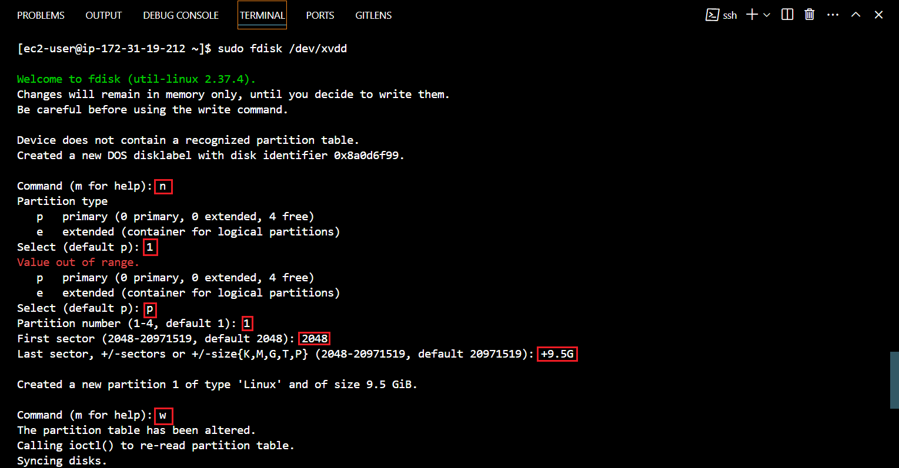

- **Provission an EC2 Instance that will serve as “Web Server”.**

Launch an EC2 instance that will serve as "Web Server". 

I will be using a **`RedHat OS`** as the underlying OS for my EC2 Server in this project.


- Create 3 EBS (Elastic Block Store) Volumes in the same AZ (Availability Zone) as your Web Server EC2, each EBS Volume should be 10 GB in size.


3 EBS volumes (volume a, b, & c) has been succesfully created and available for attachment to our server.


Open up the Linux terminal to begin configuration

Run 
```
sudo yum update
```
&
```
sudo yum upgrade
```
to update and upgrade the `RedHat OS`

** Unlike **`apt`** (Advanced Package Tool),which is is a command-line package management utility used primarily in ***Debian-based Linux distributions, such as Ubuntu, Debian, and Linux Mint***,  **`yum`** is a command-line package management utility used in ***Red Hat-based Linux distributions, such as CentOS, Fedora, and Red Hat Enterprise Linux (RHEL)***. It stands for "Yellowdog Updater Modified." yum simplifies the process of installing, updating, removing, and managing software packages on a Linux system.

Use 
```
lsblk 
```
command to inspect what block devices are attached to the server. 

The **`lsblk`** command is a Linux command used to list information about block devices attached to the system. ***It stands for "list block devices."***

Notice names of your newly created devices. All devices in Linux reside in **`/dev/`** directory. 


Inspect it with ls /dev/ and make sure you see all 3 newly created block devices there – their names are xvdb, xvdc, xvdd.


Use 
```
df -h 
```
command to see all mounts and free space on your server.

Use fdisk utility to create a single partition on each of the 3 disks.

```
sudo fdisk /dev/xvdb
```


Use `lsblk` utility to view the newly configured partition on each of the 3 disks.


Install `lvm2` package using 

**`lvm2:`** This is a ***Logical Volume Manager*** version 2, which is a system toolset that provides logical volume management capabilities on Linux systems. LVM allows you to manage disk space more flexibly by abstracting physical storage devices into logical volumes that can be resized and moved dynamically.

```
sudo yum install lvm2
```
Run 
```
run rpm -q lvm2 

or

yum list installed | grep lvm2
```
to ensure lvm is succesfully installed.


run
```
sudo lvmdiskscan
```
 command to check for available partitions.


Use **`pvcreate utility`** to mark each of 3 disks as physical volumes (PVs) to be used by LVM.


Verify that your Physical volume has been created successfully by running 
```
sudo pvs
```


Use `vgcreate utility` to add all 3 PVs to a volume group (VG). Name the VG webdata-vg

The **`vgcreate utility`** is part of the Logical Volume Manager (LVM) suite of tools on Linux systems. It is used to create a new volume group (VG) within the LVM infrastructure.

```
sudo vgcreate webdata-vg /dev/xvdb1 /dev/xvdc1 /dev/xvdd1
```
Verify that your VG has been created successfully by running 
```
sudo vgs
```


Use `lvcreate utility` to create 2 logical volumes. apps-lv (Use half of the PV size), and logs-lv Use the remaining space of the PV size. 

***NOTE: apps-lv will be used to store data for the Website while, logs-lv will be used to store data for logs.***

```
sudo lvcreate -n apps-lv -L 14G webdata-vg
sudo lvcreate -n logs-lv -L 14G webdata-vg
```
Verify that your Logical Volume has been created successfully by running 
```
sudo lvs
```


Verify the entire setup

sudo vgdisplay -v #view complete setup - VG, PV, and LV


```
sudo lsblk 
```
